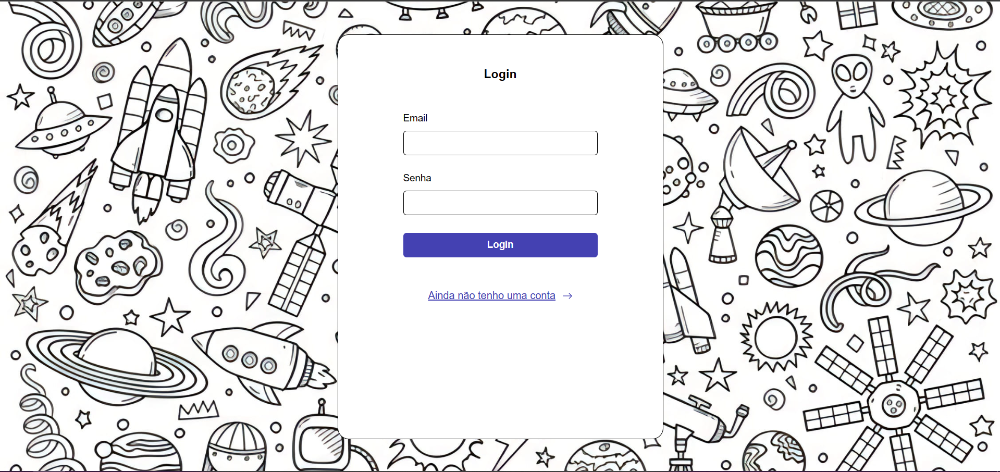
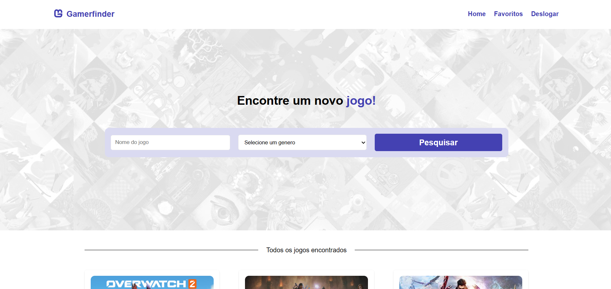
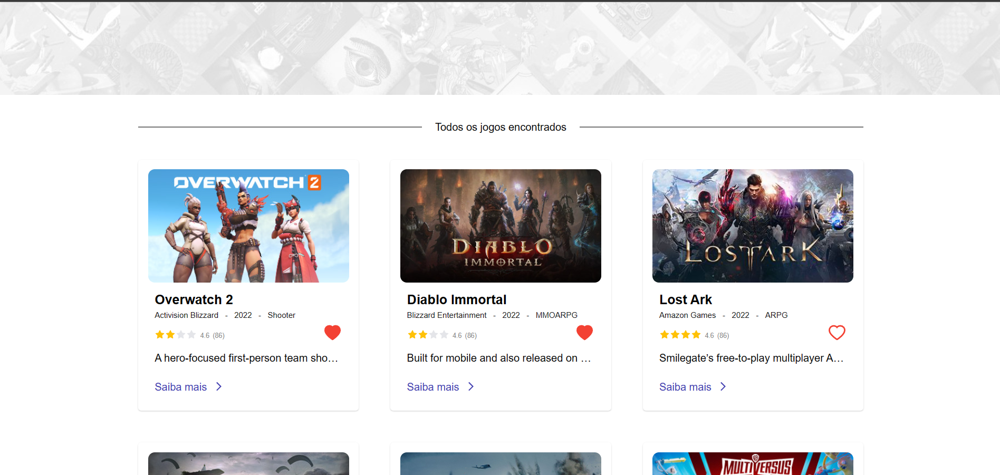
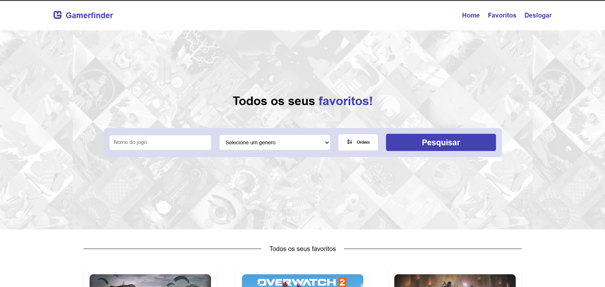

# Teste FrontEnd da appMaster.

  

  

   
  

## Link de acesso online 📟

- https://gamerfinder.netlify.app/

## Descrição do projeto

   E necessário implementar o frontend para apresentar uma lista de jogos, que será fornecida por uma API. Porém, essa API é estranha… não tem documentação, dá uns erros, ora responde, ora falha, pede um `header`👀 lá...!

:memo: Adicinar estrutura de pastas

## Imagens da Aplicação

- Tela de Login

- Tela inicial

- Favoritos

